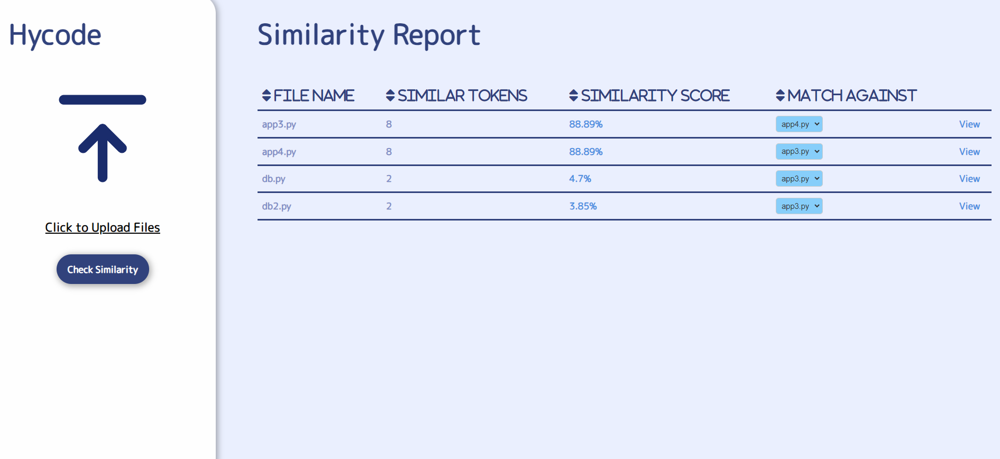
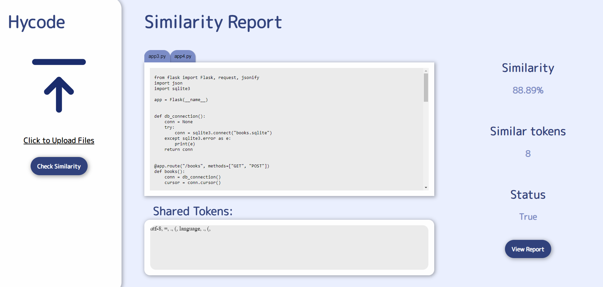

# HyCode: Check Similarity between Source Code Files

"HyCode" is an innovative project designed to streamline the process of checking similarity between source code files. With this tool, users can input any number of source code files, and HyCode will efficiently compare each file against one another. The result? A comprehensive and detailed report highlighting the similarities and differences between the code files.


## Features

- Multiple File Comparison: HyCode allows users to input multiple source code files simultaneously for comparison, enabling efficient analysis of similarities and differences across the entire codebase.
- Detailed Report Generation: Upon completion of the comparison process, HyCode generates a comprehensive report that provides detailed insights into the similarities and variations between each pair of code files. This report includes metrics such as code structure, syntax, and logic comparison.


## Screenshots





## Installation

Ensure you have Python installed on your system. Then clone this repository:

```bash
  git clone [repository-link]
  cd [repository-directory]
```

Install the required packages:

```bash
pip install -r requirements.txt
```

## Usage/Examples

To run the flask app:
```cmd
flask run
```
